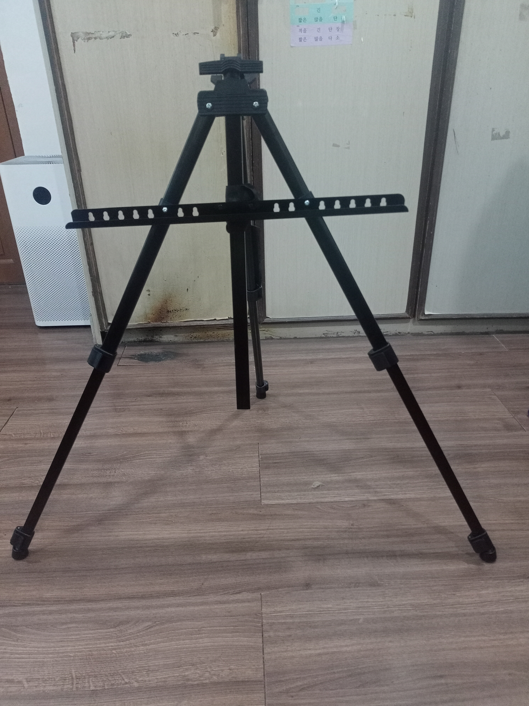
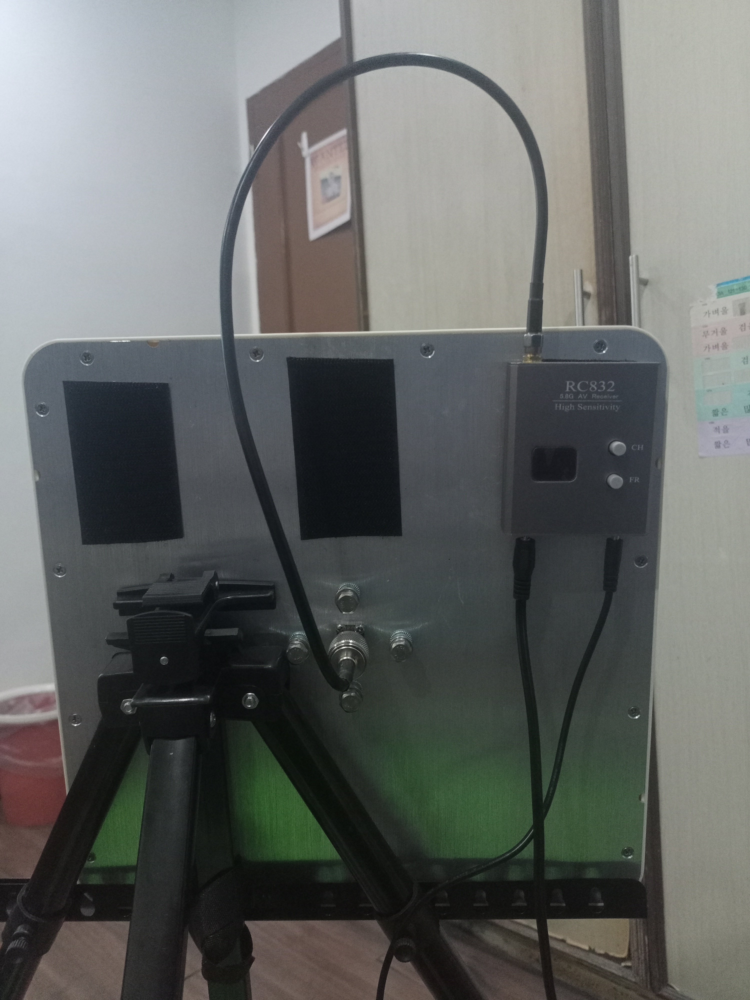
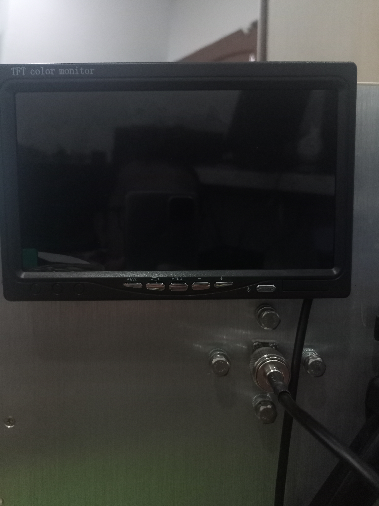
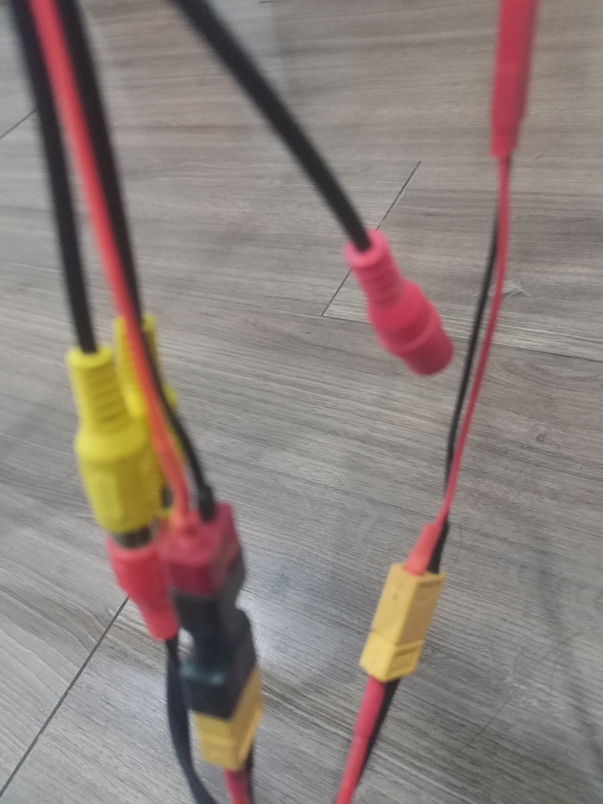
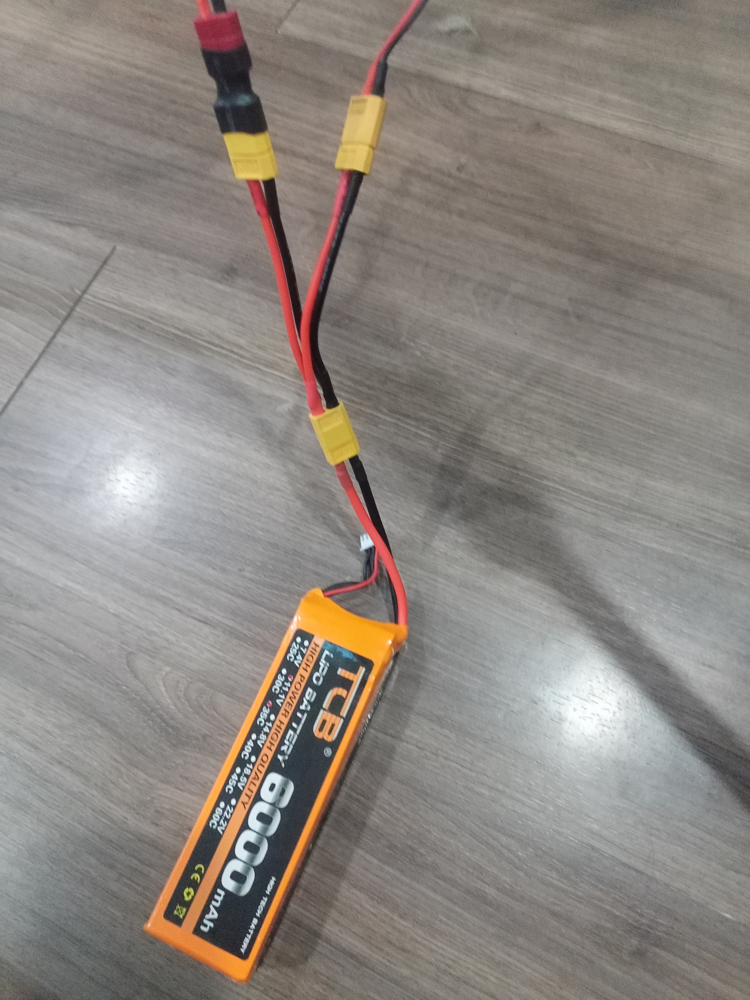
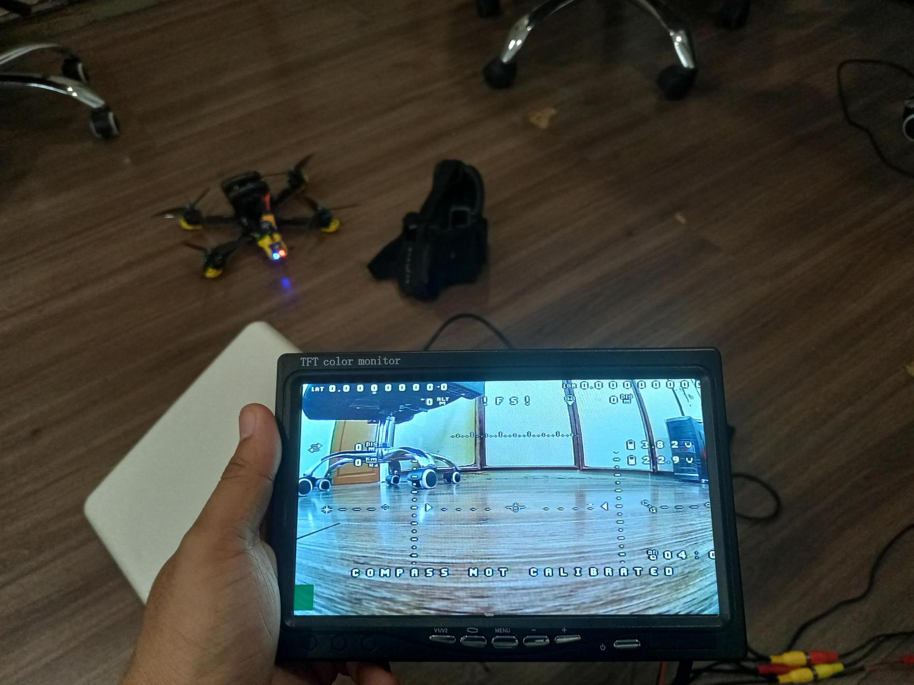
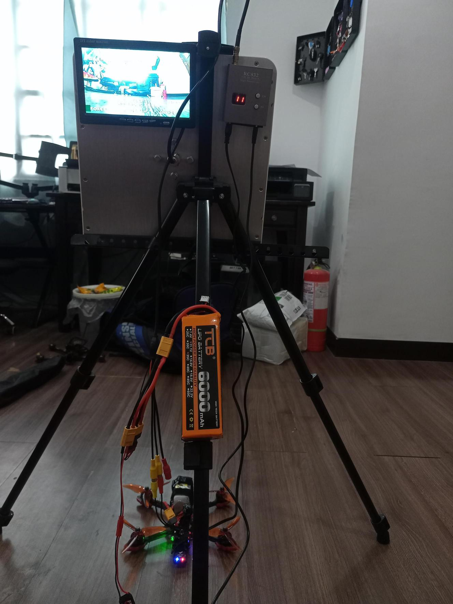

# Abu-Villa-Ground-Station

## Table of Contents
1. [Introduction](#introduction)
2. [Parts Needed](#parts-needed)
3. [Building the FPV Ground Station](#building-the-fpv-ground-station)
    1. [Assemble the Frame](#assemble-the-frame)
    2. [Mount the Receiver](#mount-the-receiver)
    3. [Install the Display](#install-the-display)
    4. [Connect Power Supply](#connect-power-supply)
    5. [Configure the Receiver and Display](#configure-the-receiver-and-display)
    6. [Test the Setup](#test-the-setup)
4. [Conclusion](#conclusion)

## Introduction
This guide will walk you through the process of building an FPV (First Person View) ground station. A ground station is essential for receiving live video feeds from your FPV drone, providing a more immersive flying experience.

## Parts Needed

| Part                       | Link to Buy                                   | Price  |
|----------------------------|-----------------------------------------------|--------|
| Frame or case              | [Link](https://shopee.ph/Thick-Aluminum-Mini-Easel-Stand-Folding-Telescopic-Display-Painting-Display-Stand-with-Carry-Pouch-i.591723908.14833487976)             | $3.72 |
| FPV receiver               | [Link](https://shopee.ph/Eachine-RC832-5.8Ghz-48CH-Wireless-Raceband-AV-Boscam-FPV-Receiver-i.44364911.18684892381?sp_atk=6118f39d-b667-4725-8156-79c8e77e2160&xptdk=6118f39d-b667-4725-8156-79c8e77e2160)          | $12.73 |
| FPV monitor                | [Link](https://www.amazon.com/Monitor-1024x600-Display-Screen-Connector/dp/B07568FY43)           | $56.99 |
| Battery                    | [Link](https://shopee.ph/4S-22.2V-14.8V-11.V-RC-LiPo-Battery2200-3500-4200-5200-6000mAh-45C60C-Helicopter-Aircraft-Quadcop-i.1058523913.28756322336?xptdk=d7e4acfd-0d42-46e3-b326-b2630da04d42)           | $30.59 |
| Antennas for the receiver  | [Link](https://www.aliexpress.com/item/1005002830777853.html?spm=a2g0o.detail.pcDetailTopMoreOtherSeller.4.7b80t3Mxt3Mxga&gps-id=pcDetailTopMoreOtherSeller&scm=1007.40050.354490.0&scm_id=1007.40050.354490.0&scm-url=1007.40050.354490.0&pvid=85dbfe33-aa13-48db-823d-1a0eb9691e24&_t=gps-id:pcDetailTopMoreOtherSeller,scm-url:1007.40050.354490.0,pvid:85dbfe33-aa13-48db-823d-1a0eb9691e24,tpp_buckets:668%232846%238110%231995&pdp_npi=4%40dis%21PHP%217976.05%213988.03%21%21%21132.80%2166.40%21%402140e84617226705969326558eb37b%2112000022379082669%21rec%21PH%21%21ABXZ&utparam-url=scene%3ApcDetailTopMoreOtherSeller%7Cquery_from%3A)          | $69.00 |
| Y Splitter                 | [Link](https://shopee.ph/XT60-Parallel-Battery-Connector-Male-Female-Cable-Dual-Extension-Y-Splitter-3-Way-14AWG-Silicone-Wire-for-RC-Battery-Motor-i.53025630.20290857523?sp_atk=c9acc8d1-4541-49d3-9c35-b5a25b88769a&xptdk=c9acc8d1-4541-49d3-9c35-b5a25b88769a)         | $1.02 |
| Tapes                      | [Link](https://shopee.ph/Velcro-Tape-with-Adhesive-Hook-and-Loop-Tape-Fastener-Mosquito-Net-Home-Improvement-DIY-Tools-i.878494567.18953196660?sp_atk=8e0292d7-80a7-45a8-a1df-06e30c80ba4d&xptdk=8e0292d7-80a7-45a8-a1df-06e30c80ba4d)             | $1.71 |

## Building the FPV Ground Station

### 1. Assemble the Frame
1. Choose a frame or case that suits your components.
    - 

### 2. Mount the Receiver
1. Attach the FPV receiver to the frame.
2. Connect the antennas to the receiver.
    - 

  

### 3. Install the Display
1. Secure the display monitor to the frame.
    - 
2. Connect to the signal cable of the receiver.

### 4. Connect Power Supply
1. Connect the power supply to the receiver and display.
    - If using a LiPo battery, ensure you have the correct connectors.
        - 
    

### 5. Configure the Receiver and Display
1. Connect the power supply.
    - 
2. Set the receiver to the correct channel and frequency.
    - 
3. Adjust the display settings (brightness, contrast, etc.) as needed.
 - 

### 6. Test the Setup
1. Power on your FPV drone and ensure it is transmitting video.
2. Verify that the ground station is receiving the video feed.
3. Check for signal quality and make any necessary adjustments to the receiver or antennas.
    - 
   

## Conclusion
Congratulations! You have successfully built an FPV ground station. With this setup, you can now enjoy live video feeds from your FPV drone, enhancing your flying experience.

For any troubleshooting or additional configurations, refer to the manuals of your specific components or seek advice from the FPV community.
